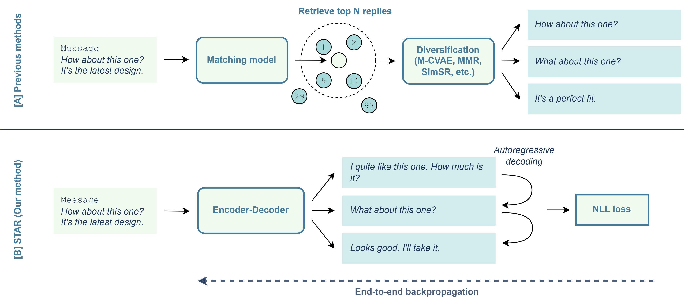

[[code]](https://github.com/BenjaminTowle/STAR)

Reply suggestion systems represent a staple component of many instant messaging and email systems. However, the requirement to produce sets of replies, rather than individual replies, makes the task poorly suited for out-of-the-box retrieval architectures, which only consider individual message-reply similarity. As a result, these system often rely on additional post-processing modules to diversify the outputs. However, these approaches are ultimately bottlenecked by the performance of the initial retriever, which in practice struggles to present a sufficiently diverse range of options to the downstream diversification module, leading to the suggestions being less relevant to the user. In this paper, we consider a novel approach that radically simplifies this pipeline through an autoregressive text-to-text retrieval model, that learns the smart reply task end-to-end from a dataset of (message, reply set) pairs obtained via bootstrapping. Empirical results show this method consistently outperforms a range of state-of-the-art baselines across three datasets, corresponding to a 5.1\%-17.9\% improvement in relevance, and a 0.5\%-63.1\% improvement in diversity compared to the best baseline approach. We make our code publicly available.

[Download paper here](https://arxiv.org/abs/2310.18956)

Recommended citation: End-to-End Autoregressive Retrieval via Bootstrapping for Smart Reply Systems (Towle & Zhou, FINDINGS-EMNLP 2023).
